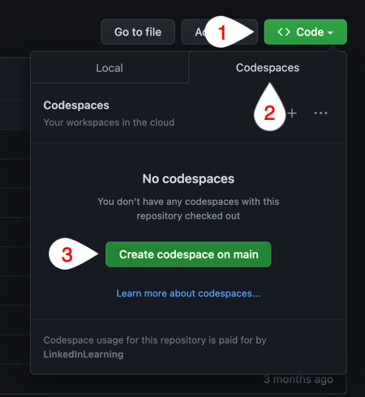

# Nom final de la formation

Ce dossier Repository est lié au cours `Nom final de la formation`. Le cours entier est disponible sur [LinkedIn Learning][lil-course-url].

![Nom final de la formation][lil-thumbnail-url] 

DESCRIPTION DE LA FORMATION

## Instructions

Ce cours est intégré avec GitHub Codespaces, un environnement de développement cloud offrant les fonctionnalités de votre IDE préféré sans devoir configurer une machine locale. Avec GitHub Codespaces, vous pouvez vous exercer à partir de n'importe quelle machine, à tout moment.
Pour lancer Github Codespaces
1. Cliquez sur le bouton `Code`.
2. Basculez sur l'onglet `Codespaces`.
3. Cliquez sur le bouton `Create codespace on main`.

Ces trois étapes sont illustrées dans l'image ci-dessous.

 
## Utiliser les fichiers d'exercices

Une fois Github Codespaces lancé (voir ci-dessus), vous trouverez les exercices associés à cette formation dans le dossier *defis*. Chaque défi est numéroté comme suit : `[Chapitre]_[Video]_nomDuDéfi`.
Par exemple, le dossier `01_02_titreDeSection` contient les fichiers nécessaires au défi sur les *titres de sections* qui vous est proposé dans la *seconde* vidéo du *premier* chapitre

### Formateur

**Damien Bruyndonckx** 

 Retrouvez mes autres formations sur [LinkedIn Learning][lil-URL-trainer].

[0]: # (Replace these placeholder URLs with actual course URLs)
[lil-course-url]: https://www.linkedin.com
[lil-thumbnail-url]: https:
[lil-URL-trainer]: https://
